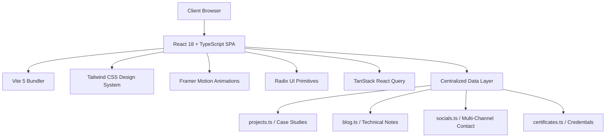

# ⚡ Aqib Jawwad Nahin — Engineering Portfolio & Architecture Showcase

<div align="center">

[](https://aqibjawwad.me)
[](https://react.dev/)
[](https://www.typescriptlang.org/)
[](https://vitejs.dev/)
[](https://tailwindcss.com/)
[](https://www.framer.com/motion/)

<br/>

**Full Stack Developer & Software Engineer**  
*Khulna, Bangladesh · Open to Global Remote Opportunities*

[Explore Live Portfolio](https://aqibjawwad.me) · [View Case Studies](https://aqibjawwad.me/projects) · [Read Technical Articles](https://aqibjawwad.me/blog) · [Contact Me](https://aqibjawwad.me/#contact)

</div>

---

## 📑 Table of Contents

- [📌 Overview](#-overview)
- [🏛️ Featured Case Studies & System Architecture](#️-featured-case-studies--system-architecture)
- [✍️ Technical Writing & Engineering Notes](#️-technical-writing--engineering-notes)
- [🎨 Design System & Aesthetic Architecture](#-design-system--aesthetic-architecture)
- [🌐 Multi-Channel Social & Contact Architecture](#-multi-channel-social--contact-architecture)
- [🛠️ Complete Technology Stack](#️-complete-technology-stack)
- [📁 Repository Structure](#-repository-structure)
- [🚀 Quick Start & Local Setup](#-quick-start--local-setup)
- [🧪 Quality Assurance & Testing](#-quality-assurance--testing)
- [👤 Contact & Connect](#-contact--connect)
- [📄 License](#-license)

---

## 📌 Overview

This repository contains the complete source code for **Aqib Jawwad Nahin's** personal portfolio, architectural case studies, interactive SVG system diagrams, and technical engineering notes.

The platform is designed to provide engineering teams, hiring managers, and collaborators with deep technical insights into complete full-stack web applications, relational schemas, system pipelines, and clean architecture practices.

### Key Highlights
- **Editorial Geometric Sans Typography:** Powered by `Sora`, `Space Grotesk`, and `Outfit` on an obsidian dark palette (`#0D0D0D`) with amber gold accents (`#FACC15`).
- **Interactive SVG Architecture Diagrams:** Technically defensible, responsive system flowcharts mapping client SPAs, REST controllers, relational databases, and AI generation pipelines.
- **Strict 100% Fluid Responsiveness:** Fluid layouts tested across 25 device viewports (from 320px ultra-narrow mobile to 3440px ultrawide displays) with zero horizontal overflow.
- **WCAG Accessibility & Reduced Motion:** Pointer-only custom cursor with automatic disabling on touch screens and under `prefers-reduced-motion: reduce`, full keyboard Tab/Arrow navigation, and semantic landmarks.

---

## 🏛️ Featured Case Studies & System Architecture

Each project case study includes problem statements, business requirements, architectural decisions, technical trade-offs, security considerations, and dedicated vector architecture diagrams:

| Project | Domain / Category | Stack | Highlights & Links |
| :--- | :--- | :--- | :--- |
| **[Reqs.ai](https://aqibjawwad.me/projects/reqs-ai)** | AI Software Planning SaaS | React, TypeScript, Laravel, MySQL, AI APIs | Automated PRD generation, modular prompt pipelines, versioned document workspaces. |
| **[Clinexa HMS](https://aqibjawwad.me/projects/clinexa)** | Hospital Management System | React, TypeScript, Laravel, PHP, MySQL, REST APIs | Multi-department OPD/IPD workflows, patient billing, pharmacy inventory, lab records. <br/>• [Live Demo](https://clinexa-chi.vercel.app/) · [GitHub Repo](https://github.com/Aqib2607/clinexa) |
| **[Restaurant Management](https://aqibjawwad.me/projects/restaurant-management)** | Operations & POS System | Laravel MVC, PHP, MySQL, React, TypeScript | Atomic database transactions, stock deduction triggers, active table order management. |
| **[Virtual CPU Emulator](https://aqibjawwad.me/projects/virtual-cpu-emulator)** | Computer Systems Architecture | TypeScript, OOP, Computer Architecture | Cycle-accurate instruction simulation: Opcode Fetch, Decode, ALU execution, and register state. |

---

## ✍️ Technical Writing & Engineering Notes

The portfolio includes an in-depth engineering blog covering practical software engineering concepts and real-world trade-offs:

1. **[Scaling Laravel: When to Reach for Redis](https://aqibjawwad.me/blog/scaling-laravel-redis)**  
   *Techniques for granular cache invalidation using cache tags, asynchronous queue offloading for heavy jobs, and pub/sub messaging patterns.*

2. **[Mastering Optimistic Updates with React Query](https://aqibjawwad.me/blog/react-query-optimistic-ui)**  
   *Building zero-latency user interfaces with React Query's `onMutate` lifecycle, UI state pre-population, and rollback snapshots on network failures.*

3. **[Applying SOLID Principles to React Components](https://aqibjawwad.me/blog/solid-principles-frontend)**  
   *Practical implementations of Single Responsibility, Dependency Inversion, and Open-Closed principles for maintainable frontend architectures.*

---

## 🎨 Design System & Aesthetic Architecture

The visual architecture is inspired by modern editorial portfolios, prioritizing typography hierarchy, generous negative space, and responsive rhythm:

- **Canvas Background:** Obsidian Dark (`#0D0D0D`)
- **Card / Surface Background:** Deep Charcoal (`#141414` / `#161616`)
- **Primary Accent:** Amber Gold (`#FACC15` / `#F4CE14`)
- **Display Typography:** Sora & Space Grotesk (Geometric Sans)
- **Body Typography:** Outfit
- **Monospace / Code:** SF Mono / JetBrains Mono / Fira Code
- **Micro-Interactions:** Custom blend-mode cursor (`mix-blend-mode: difference`), subtle card lift states, and spring-eased dialog transitions.

---

## 🌐 Multi-Channel Social & Contact Architecture

All contact and social links across the application are driven by a centralized data structure in [`src/data/socials.ts`](src/data/socials.ts), ensuring zero duplicate URLs and instant single-point configuration:

| Platform | Handle / Address | Direct Action / URL |
| :--- | :--- | :--- |
| **Email** | `aqibjawwad2607@gmail.com` | [mailto:aqibjawwad2607@gmail.com](mailto:aqibjawwad2607@gmail.com) |
| **Phone** | `+880 1946-664836` | [tel:+8801946664836](tel:+8801946664836) |
| **WhatsApp** | `+880 1946-664836` | [https://wa.link/vnl10u](https://wa.link/vnl10u) |
| **LinkedIn** | `Aqib Jawwad Nahin` | [linkedin.com/in/aqib-jawwad-nahin-598288278/](https://www.linkedin.com/in/aqib-jawwad-nahin-598288278/) |
| **GitHub** | `@Aqib2607` | [github.com/Aqib2607](https://github.com/Aqib2607) |
| **Facebook** | `@Aqib2607` | [facebook.com/Aqib2607/](https://www.facebook.com/Aqib2607/) |
| **Instagram** | `@aqib.jawwad` | [instagram.com/aqib.jawwad/](https://www.instagram.com/aqib.jawwad/) |

*Contact experience features RFC-compliant `mailto:` generation, a 1-click clipboard utility for webmail users (Gmail, Outlook), and zero unauthenticated external form dependencies.*

---

## 🛠️ Complete Technology Stack



| Layer | Tools & Libraries | Purpose |
| :--- | :--- | :--- |
| **Core Framework** | React 18 (SWC), TypeScript 5.8 | Component architecture & type-safe development |
| **Routing** | React Router DOM 6 | Client-side routing with slug alias resolution |
| **Styling** | Tailwind CSS 3, PostCSS, Autoprefixer | Utility-first CSS, responsive breakpoints & custom typography |
| **Animation** | Framer Motion 12 | Smooth layout animations and gesture transitions |
| **UI Primitives** | Radix UI (`@radix-ui/*`) | Accessible headless modal dialogs, tooltips, and tabs |
| **Icons & SVGs** | Lucide React, Custom Brand SVGs | Resolution-independent iconography |
| **Notifications** | Sonner | Accessible toast feedback for clipboard interactions |
| **SEO & Social Meta**| React Helmet Async, JSON-LD | Dynamic title tags, canonical links, Open Graph & Twitter Cards |

---

## 📁 Repository Structure

```text
portfolio/
├── public/                         # Public assets & search engine metadata
│   ├── about/                      # Profile image assets
│   ├── certificates/               # Verified credentials & simulation certificates
│   ├── projects/                   # Case study preview mockups & diagrams
│   ├── robots.txt                  # Search engine crawl rules
│   └── sitemap.xml                 # Canonical XML sitemap with all public URLs
├── src/
│   ├── components/                 # Core modular UI components
│   │   ├── diagrams/               # Dedicated SVG System Architecture Diagrams
│   │   │   ├── ArchitectureDiagrams.tsx
│   │   │   └── diagramTokens.ts
│   │   ├── ui/                     # Reusable Radix UI & Shadcn components
│   │   ├── AboutSection.tsx        # Career journey & academic history
│   │   ├── BrandIcons.tsx          # Brand SVG icons for WhatsApp, FB, IG, etc.
│   │   ├── Capabilities.tsx        # 4-pillar engineering capabilities
│   │   ├── Contact.tsx             # Contact section & form with mailto/copy utility
│   │   ├── ConversationCTA.tsx     # Full-width discussion call-to-action
│   │   ├── CustomCursor.tsx        # Pointer-only desktop interactive cursor
│   │   ├── EditorialStatement.tsx  # Hero editorial philosophy statement
│   │   ├── EngineeringPerspective.tsx # Engineering perspective section
│   │   ├── Footer.tsx              # Multi-column footer with contact links
│   │   ├── Hero.tsx                # Hero section with primary CTAs & social links
│   │   ├── Navigation.tsx          # Responsive sticky navigation & mobile drawer
│   │   ├── Projects.tsx            # Featured case study showcase
│   │   ├── SocialLinks.tsx         # Reusable social channels component
│   │   └── Testimonials.tsx        # Accessible testimonial slider with keyboard navigation
│   ├── data/                       # Centralized data sources
│   │   ├── blog.ts                 # Full markdown engineering articles
│   │   ├── certificates.ts         # Verified internship and simulation records
│   │   ├── projects.ts             # Authentic technical case studies
│   │   └── socials.ts              # Single source of truth for all contact channels
│   ├── pages/                      # Lazy-loaded route views
│   │   ├── BlogPage.tsx            # Engineering articles directory
│   │   ├── BlogPost.tsx            # Full-page article reader
│   │   ├── CertificatesPage.tsx    # Credentials & job simulations directory
│   │   ├── Landing.tsx             # Primary portfolio landing page
│   │   ├── NotFound.tsx            # Custom 404 error page
│   │   ├── PhilosophyPage.tsx      # Engineering philosophy & principles
│   │   ├── ProjectCaseStudy.tsx    # Comprehensive project case study page
│   │   ├── ProjectsPage.tsx        # Full projects directory
│   │   └── ResumePage.tsx          # Digital & printable CV
│   ├── App.tsx                     # Global routes, Suspense, and Layout wrapper
│   ├── index.css                   # Global CSS design tokens, typography & animations
│   └── main.tsx                    # Application bootstrap entry point
├── index.html                      # HTML entry with Open Graph, Twitter cards & JSON-LD
├── tailwind.config.ts              # Tailwind design tokens & font family mappings
├── vite.config.ts                  # Vite build & development server config
└── package.json                    # Dependencies & npm scripts
```

---

## 🚀 Quick Start & Local Setup

### Prerequisites
- **Node.js:** `v18.0.0` or higher
- **Package Manager:** `npm` or `bun`

### 1. Clone the Repository
```bash
git clone https://github.com/Aqib2607/portfolio.git
cd portfolio
```

### 2. Install Dependencies
```bash
npm install
```

### 3. Start Development Server
```bash
npm run dev
```
Open [http://localhost:8080](http://localhost:8080) in your browser.

### 4. Build for Production
```bash
npm run build
```
The compiled, production-ready static assets will be output to the `dist/` directory.

### 5. Preview Production Build
```bash
npm run preview
```

---

## 🧪 Quality Assurance & Testing

```bash
# Run ESLint to verify code quality and style compliance
npm run lint

# Compile production bundle and verify TypeScript types
npm run build
```

- **ESLint Status:** `0 errors`, `0 warnings`
- **Build Status:** Clean bundle compilation in `<5s`
- **Bundle Optimization:** Full route-level code splitting via `React.lazy()` and `Suspense`

---

## 👤 Contact & Connect

**Aqib Jawwad Nahin**  
*Full Stack Developer & Software Engineer*

- **Website:** [https://aqibjawwad.me](https://aqibjawwad.me)
- **Email:** [aqibjawwad2607@gmail.com](mailto:aqibjawwad2607@gmail.com)
- **Phone / WhatsApp:** [+880 1946-664836](https://wa.link/vnl10u)
- **LinkedIn:** [linkedin.com/in/aqib-jawwad-nahin-598288278/](https://www.linkedin.com/in/aqib-jawwad-nahin-598288278/)
- **GitHub:** [@Aqib2607](https://github.com/Aqib2607)
- **Facebook:** [facebook.com/Aqib2607/](https://www.facebook.com/Aqib2607/)
- **Instagram:** [@aqib.jawwad](https://www.instagram.com/aqib.jawwad/)

---

## 📄 License

This project is open-source and available under the [MIT License](LICENSE).